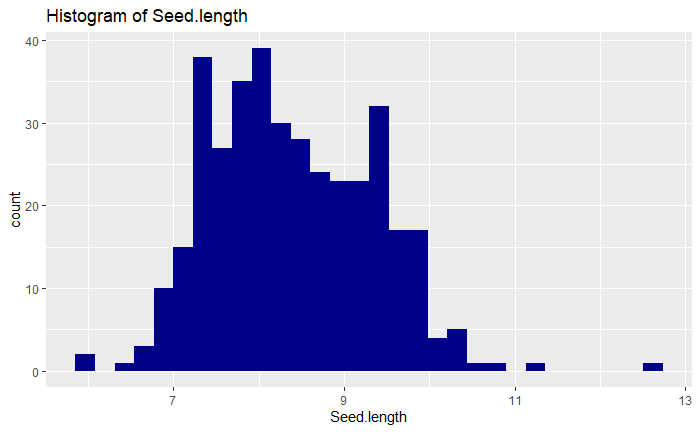
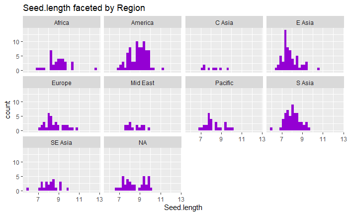
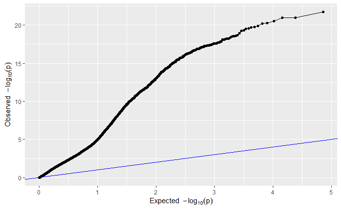
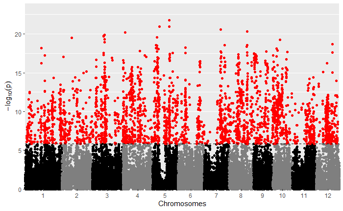
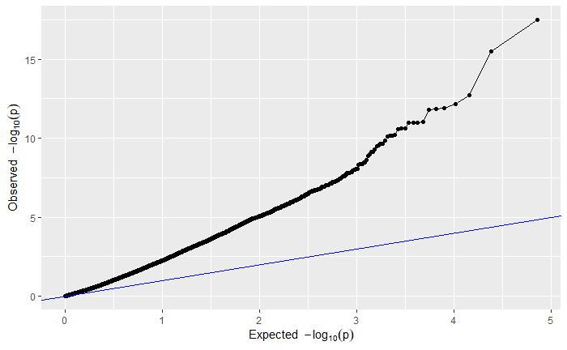
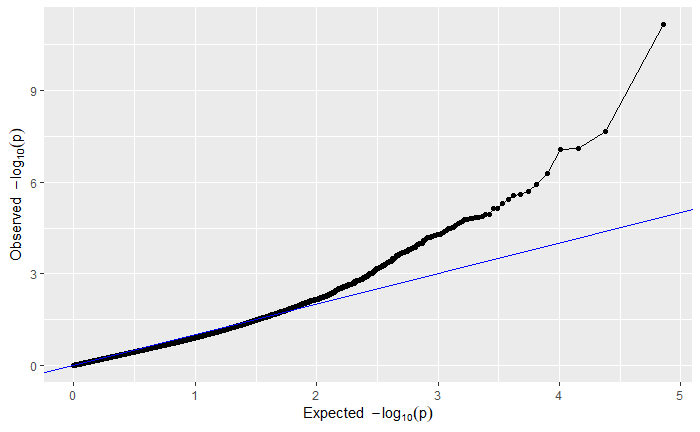
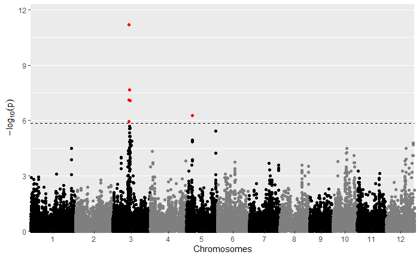

# Rice-GWAS

Welcome! This repo contains multiple GWASs performed on processed SNP data, following the analysis found in my [Rice-PCA-SNPs](https://github.com/aangush/Rice-PCA-SNPs) repo. This workflow was adapted from the course BIS 180L Genomics Laboratory at UC Davis, and the SNPs examined were derived from a bulk RNA seq experiment on different
strains of rice.

### File Structure
______

This repo contains three directories: `input`, `output`, and `scripts`. `input` and `output` contain input and output data to be processed/retrieved by different programs (usually stored locally). `scripts` contains an .Rmd file and the associated html version which can be used to view all inputs and outputs of the code used in this analysis. Also in `scripts` is an R script that contains all R in this analysis. The workflow in this repo was performed entirely with R.

### Workflow Overview
______

As mentioned, this project makes use of data previously gathered/processed in my [Rice-PCA-SNPs](https://github.com/aangush/Rice-PCA-SNPs) repo: the SNPs, principle components, population assignments (by fastStructure), and associated phenotype data. Then the PCs, population assignments, and phenotype data were all joined to one object. 

I chose the trait _seed length_ as my trait of interest and next examined some of the variation in seed length in the dataset. I first produced some visualizations of seed length data like those shown below:

After, the means and standard error of the means for seed length for each region were calculated, and used to perform an ANOVA. This test revealed that there are significant differences in mean seed length by region (p-value 1.81e-12). Unfortunately (but not unsurprisingly), mean seed length also significantly varied depending on fastStructure population assignment (ANOVA, p-value 8.8e-15) -- suggesting that in a GWAS population structure would need to be taken into consideration.

To use statgenGWAS to perform GWASs, four data frames (and an optional 5th) are required:

1. genotype data which contains the genotype at each SNP for each individual/strain
2.  genotype map that contains the chromosome and position numbers of each SNP (SNPs in this data frame must be in the same order as the latter)
3. a data frame with phenotype data
4. a kinship matrix
5. (optional) a covariate data frame that can be used to estimate population structure

After each of these data frames are prepared, they are brought together into one gdata object which is subsequently used to perform GWAS. The genotype data also
must be recoded, redundant SNPs must be removed, and missing values replaced. statgenGWAS has a function to do this. 

In this analysis I ran three GWAS: 

1. No pop. structure correction
2. PCs used for pop. structure correction
3. Kinship matrix used for pop. structure correction

For your viewing pleasure, I've included the qq and manhattan plots from each analysis below.

##### No pop. structure correction

##### PCs as pop. structure correction

##### Kinship matrix as pop. structure correction

By comparing the qq and manhattan plots from each GWAS, it appears that in this case using a kinship matrix was the best way to control 
for population structure as it resulted in the fewest significant SNPs and the best looking qq plot.
